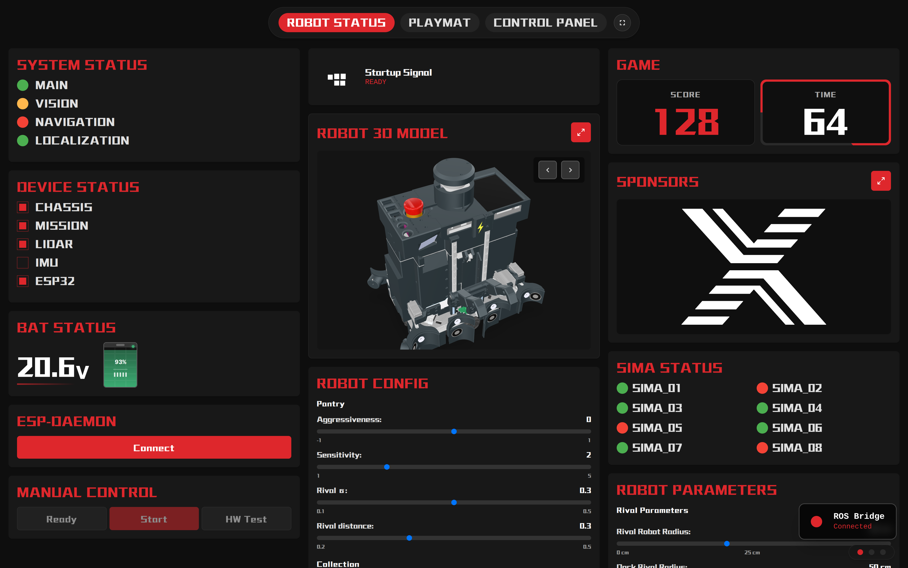
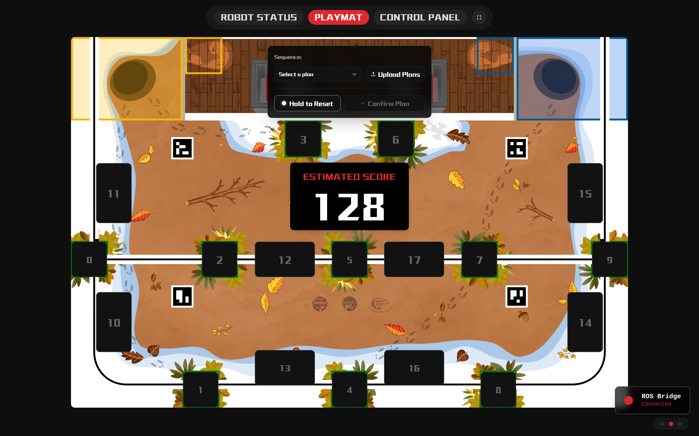
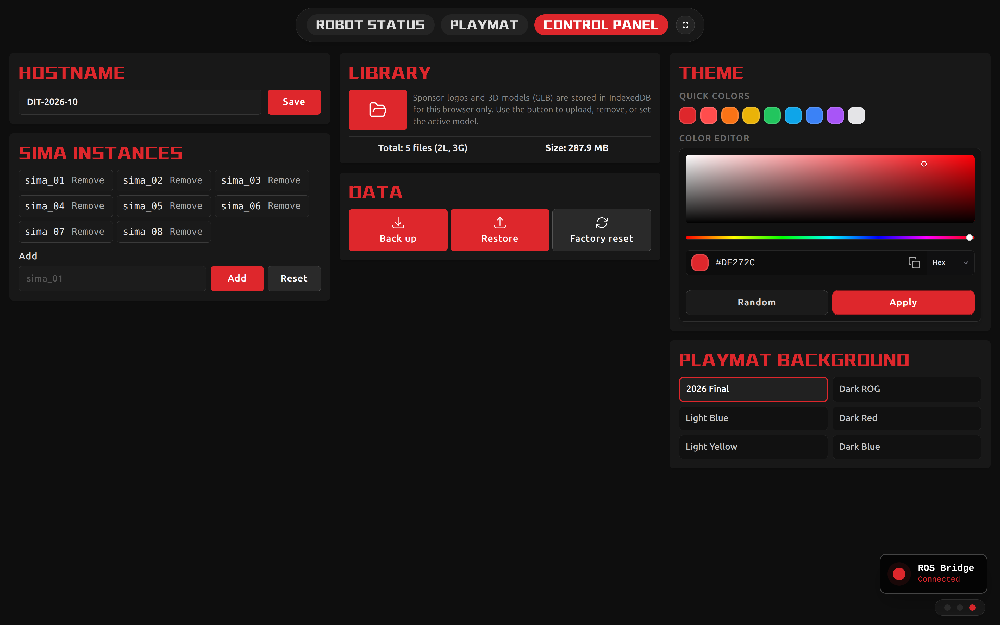

<div align="center">

# Eurobot Web

**A web dashboard built for Eurobot robot competitions, focused on robot status monitoring and strategy selection.**

[](https://github.com/DIT-ROBOTICS/Eurobot-Web)
[](https://opensource.org/licenses/MIT)
[](https://www.eurobot.org/)

<table>
<tr>
<td width="33%" align="center"><br><strong>Robot Status</strong><br>ROS status, startup groups, battery, SIMA, parameters</td>
<td width="33%" align="center"><br><strong>Playmat</strong><br>Mission buttons, sequence planning, live score</td>
<td width="33%" align="center"><br><strong>Control Panel</strong><br>Layout, theme, SIMA names, backup, assets</td>
</tr>
</table>

<br>

[**Features**](#features) &#8226;
[**ROS Bridge Interfaces**](#ros-bridge-interfaces) &#8226;
[**API And Config Files**](#api-and-config-files) &#8226;
[**Getting Started**](#getting-started) &#8226;
[**Deployment**](#deployment) &#8226;
[**Development**](#development)

</div>

---

## Features

Eurobot 2026 Web is a React dashboard for the robot-side screen, laptop, iPad, or dual-monitor pit setup. It connects to ROS 2 through [rosbridge](https://github.com/RobotWebTools/rosbridge_suite), persists competition parameters in `/home/share/data`, and keeps local UI assets such as robot GLB files and sponsor logos in browser storage.

The app has three primary panels:

| Panel | Current functionality |
|------|------------------------|
| **Robot Status** | ROS bridge connection state, battery voltage, USB device status, startup plug signal, startup group state, game time, game score, SIMA online status, game ready/service call controls, game start publisher, on-take test publisher, rival/dock/nav/SIMA/robot-config parameter editing, sponsor fullscreen overlay, robot 3D preview. |
| **Playmat** | 2026 field visualization, 18 mission buttons, click order sequence, plan import, saved plans in browser storage, live estimated score from ROS, selected plan service server for the robot startup flow. |
| **Control Panel** | Half-screen layout toggle, active panel selection, theme accent, BMS hostname, playmat background selection, SIMA instance-name whitelist editing, browser backup/restore ZIP, factory reset for browser data, IndexedDB manager for GLB models and sponsor logos. |

---

## ROS Bridge Interfaces

The frontend loads [roslibjs](https://github.com/RobotWebTools/roslibjs) as a static script (`index.html` → `/lib/roslib.min.js`), which exposes **`window.ROSLIB`**. React code uses that global through `src/utils/useRosConnection.ts` (and a few components that read `window.ROSLIB` directly). The bridge URL is fixed in code as:

```txt
ws://localhost:9090
```

### roslib bundle (maintenance)

- **`*.min.js`**: minified build (smaller download; same runtime behavior as the non-minified bundle for a given release).
- **Stay on roslib 1.x for this app.** The checked-in file matches the classic browser bundle (global `ROSLIB`, `Ros` / `Topic` / `Service` APIs). On npm, the **`latest` tag is roslib 2.x**, which ships as ES modules for bundlers and is **not** a drop-in replacement for a single script tag; migrating would mean importing from `roslib` in Vite, removing the global, and re-testing every bridge call.
- **Stability:** Prefer pinning to a known 1.x release (for example `1.4.1`) rather than chasing `latest` on npm. Optional refresh from CDN (run at repo root):

  ```bash
  curl -fsSL -o public/lib/roslib.min.js 'https://unpkg.com/roslib@1.4.1/build/roslib.min.js'
  ```

  To follow the newest **1.x** line without editing the URL on each patch release, you can use `roslib@1` instead of `1.4.1` in that path.

Use this section as the rosbridge whitelist reference.

### Whitelist Summary

Topics:

```txt
/robot_status/battery_voltage
/robot_status/usb/chassis
/robot_status/usb/mission
/robot_status/usb/lidar
/robot_status/usb/esp
/robot_status/usb/imu
/robot/startup/plug
/robot/startup/groups_state
/robot/startup/game_time
/game_score
/score
/robot/startup/ideal_score
/<sima_name>/status
/robot/on_take
```

Services:

```txt
/robot/startup/ready_signal
/robot/startup/web_plan
```

Replace `/<sima_name>/status` with the exact SIMA names configured in Control Panel, for example `/sima_01/status`.

### Subscribed Topics

| Topic | Type | Used by | Content / behavior |
|------|------|---------|--------------------|
| `/robot_status/battery_voltage` | `std_msgs/msg/Float32` | Robot Status | Battery voltage. Display is smoothed and considered stale after 8 seconds without messages. |
| `/robot_status/usb/chassis` | `std_msgs/msg/Bool` | Robot Status | Chassis STM32 USB/device connectivity. |
| `/robot_status/usb/mission` | `std_msgs/msg/Bool` | Robot Status | Mission STM32 USB/device connectivity. |
| `/robot_status/usb/lidar` | `std_msgs/msg/Bool` | Robot Status | LiDAR connectivity. |
| `/robot_status/usb/esp` | `std_msgs/msg/Bool` | Robot Status | ESP32 connectivity. |
| `/robot_status/usb/imu` | `std_msgs/msg/Bool` | Robot Status | IMU connectivity. |
| `/robot/startup/plug` | `std_msgs/msg/Bool` | Robot Status | Startup plug/ready signal. `true` marks connected and expires after 5 seconds without another `true`; `false` clears immediately. |
| `/robot/startup/groups_state` | `std_msgs/msg/Int32MultiArray` | Robot Status | Startup group states in order: `MAIN`, `VISION`, `NAVIGATION`, `LOCALIZATION`. UI maps `0` to yellow, `3` to green, missing/other values to red. |
| `/robot/startup/game_time` | `std_msgs/msg/Float32` | Robot Status | Current match/game time value. |
| `/game_score` | `std_msgs/msg/Int32` | Robot Status, Playmat | Current game score. Also drives Playmat estimated score. |
| `/score` | `std_msgs/msg/Int32` | Playmat | Primary live score source. If no recent message is seen, Playmat falls back to startup ideal score. |
| `/robot/startup/ideal_score` | `std_msgs/msg/Int32` | Playmat | Fallback estimated score from the main startup process. |
| `/<sima_name>/status` | `std_msgs/msg/Bool` | Robot Status | Dynamic SIMA online status. Names come from Control Panel localStorage key `sima-instance-names`; defaults are `sima_01` through `sima_08`. A SIMA is considered stale after 1.3 seconds. |

### Published Topics

| Topic | Type | Published by | Payload |
|------|------|--------------|---------|
| `/robot/startup/plug` | `std_msgs/msg/Bool` | Robot Status | Publishes `{ data: true }` when Game Start is triggered. |
| `/robot/on_take` | `std_msgs/msg/Int32MultiArray` | Robot Status | HW Test publishes four messages at 400 ms intervals: `data` is `[1, 1, 1, 1, n]` with `n` in `0`…`3` (the fifth element is the test index). `layout` is an empty `dim` and `data_offset: 0`. |

### Service Clients

| Service | Type | Called by | Request / response handling |
|---------|------|-----------|-----------------------------|
| `/robot/startup/ready_signal` | `btcpp_ros2_interfaces/srv/StartUpSrv` | Robot Status | Called four times for groups `1` to `4` with `{ group: gid, state: 1 }`. The UI logs a warning if any response has `success=false`, then continues to the next group. |

### Service Servers Advertised By The Web UI

| Service | Type | Advertised by | Response |
|---------|------|---------------|----------|
| `/robot/startup/web_plan` | `std_srvs/srv/Trigger` | Playmat | Returns `success=true`; `message` is the selected plan id as a string, or `"0"` if no plan is selected. |

---

## API And Config Files

The Express API lives in `src/api/index.js` and is mounted under `/api` by `src/server.js`. Data is stored in `/home/share/data`; production Compose mounts that directory from the host.

### REST API

| Method | Path | Backing file | Purpose |
|--------|------|--------------|---------|
| `GET` | `/api/rival-radius` | `rival_params.yaml` | Read `nav_rival_parameters.rival_inscribed_radius` in meters. Frontend displays centimeters. |
| `POST` | `/api/rival-radius` | `rival_params.yaml` | Update rival radius, clamped to `0.0` to `0.5` m. Body: `{ "radius": number }`. |
| `GET` | `/api/dock-rival-params` | `rival_params.yaml` | Read `dock_rival_radius` and `dock_rival_degree`. |
| `POST` | `/api/dock-rival-params` | `rival_params.yaml` | Update dock rival radius and degree. Radius is clamped to `0.0` to `0.5` m; degree to `0` to `360`. |
| `GET` | `/api/nav-params?profile=<name>` | `nav_<profile>_params.yaml` | Read navigation max linear/angular velocity for `didilong`, `fast`, `slow`, `linearBoost`, or `angularBoost`. |
| `POST` | `/api/nav-params` | `nav_<profile>_params.yaml` | Update navigation profile. Body: `{ "profile": string, "linearVelocity": number, "angularVelocity": number }`. Linear is clamped to `0.1` to `1.6`; angular to `1.0` to `15.0`. |
| `GET` | `/api/sima-params` | `sima.json` | Read `sima_start_time` and `plan_code`. |
| `POST` | `/api/sima-params` | `sima.json` | Update SIMA start time and plan code. Body: `{ "sima_start_time": number, "plan_code": number }`. |
| `GET` | `/api/button-states` | `button.json` | Read playmat button states, flat sequence, and derived `pantry_sequence` / `collection_sequence`. |
| `POST` | `/api/button-states` | `button.json` | Update playmat button states and sequence. Mission arrays are derived from the flat sequence. |
| `GET` | `/api/robot-config` | `robot_config.yaml` | Read supported ROS parameter fields from `/**.ros__parameters`. Falls back to legacy `robot_config_black.yaml` if present. |
| `POST` | `/api/robot-config` | `robot_config.yaml` | Update supported robot config parameters and remove `robot_name` from the YAML. |
| `GET` | `/api/mission-sequence` | `button.json` | Read pantry/collection sequence. Legacy `mission_sequence.json` or `mission_sequence_black.json` is migrated into `button.json` when needed. |
| `POST` | `/api/mission-sequence` | `button.json` | Store manual pantry/collection sequence in `button.json`. |
| `POST` | `/api/reset-to-defaults` | all server-side config files | Reset rival, nav, SIMA, robot config, and playmat/mission state to defaults. |

### YAML / JSON Files

`rival_params.yaml`

```yaml
nav_rival_parameters:
  rival_inscribed_radius: 0.22
dock_rival_parameters:
  dock_rival_radius: 0.46
  dock_rival_degree: 120
```

Navigation profiles:

| File | `max_linear_velocity` | `max_angular_velocity` |
|------|------------------------|------------------------|
| `nav_didilong_params.yaml` | `1.5` | `1.0` |
| `nav_fast_params.yaml` | `1.1` | `12.0` |
| `nav_slow_params.yaml` | `0.8` | `2.0` |
| `nav_linearBoost_params.yaml` | `1.1` | `2.0` |
| `nav_angularBoost_params.yaml` | `0.5` | `12.0` |

`robot_config.yaml`

```yaml
/**:
  ros__parameters:
    pantry_aggressiveness: 0.0
    pantry_sensitivity: 2.0
    pantry_rival_sigma: 0.3
    pantry_rival_distance_threshold: 0.3
    collection_aggressiveness: 0.0
    collection_sensitivity: 2.0
    collection_rival_sigma: 0.3
    collection_rival_distance_threshold: 0.3
    flip_distance_threshold: 0.1
    cursor_tolerance: 0.18
```

`sima.json`

```json
{
  "sima_start_time": 85,
  "plan_code": 1
}
```

`button.json`

```json
{
  "states": {
    "0": false,
    "1": false
  },
  "sequence": [],
  "pantry_sequence": [],
  "collection_sequence": []
}
```

---

## Getting Started

### Prerequisites

- Docker and Docker Compose
- ROS 2 with `rosbridge_server`
- A rosbridge websocket available at `ws://localhost:9090`

### Run With Docker

1. Clone and enter the repo:

   ```bash
   git clone -b Eurobot-2026 https://github.com/DIT-ROBOTICS/Eurobot-Web.git
   cd Eurobot-Web
   ```

2. Start the development container:

   ```bash
   docker compose -f docker-compose.dev.yml up -d
   ```

3. Open the app:

   | Service | URL |
   |---------|-----|
   | Frontend dev server | http://localhost:5173 |
   | Express API | http://localhost:3001/api |
   | ROS bridge websocket | ws://localhost:9090 |

### Start ROS Bridge

```bash
sudo apt install ros-<distro>-rosbridge-server
ros2 launch rosbridge_server rosbridge_websocket_launch.xml
```

---

## Deployment

### Development

```bash
docker compose -f docker-compose.dev.yml up -d
docker compose -f docker-compose.dev.yml logs -f app-dev
docker compose -f docker-compose.dev.yml down
```

The dev Compose file uses host networking and starts both the Express API and Vite dev server:

```bash
bun install && node src/server.js & bun run dev -- --host 0.0.0.0
```

### Production

Images are published to **GHCR** by [`.github/workflows/docker-build-and-push.yml`](.github/workflows/docker-build-and-push.yml) on pushes to **`eurobot-YYYY` / `Eurobot-YYYY`** (for example `Eurobot-2026`). The image tag is **only the year** (`:2026`, not `latest`). Match that on the machine that runs Compose, for example:

```bash
export EUROBOT_IMAGE_TAG=2026   # optional; default in compose is 2026 for this branch
docker compose pull && docker compose up -d
docker compose logs -f eurobot-2026-web
docker compose down
```

Production runs a built React app behind Nginx, keeps the API server available, uses host networking, and persists server-side config through:

```txt
/home/share/data:/home/share/data
```

---

## Development

### Stack

| Area | Technology |
|------|------------|
| Frontend | React 19, TypeScript, Vite |
| Styling | Tailwind CSS 4, Radix UI, Lucide React, React Icons |
| ROS bridge | roslib 1.x browser bundle (`public/lib/roslib.min.js`, `window.ROSLIB`) over WebSocket |
| API server | Express, js-yaml |
| 3D assets | model-viewer, Three.js / React Three Fiber dependencies |
| Browser storage | localStorage, IndexedDB, JSZip backup/restore |
| Deployment | Docker, Docker Compose, Nginx |

### Useful Commands

```bash
npm run dev
npm run build
npm run lint
npm run server
```

### Browser-Side Data

The Control Panel can export and restore browser-local data as `eurobot-web-backup_YYYYMMDD.zip`. The backup includes selected localStorage keys, custom robot GLB files, and sponsor logos. Server-side `/home/share/data` YAML/JSON files are not included in that browser backup.

Important localStorage keys include:

| Key | Purpose |
|-----|---------|
| `sima-instance-names` | Dynamic SIMA topic names used for `/<name>/status`. |
| `bms-hostname` | BMS/ESP hostname shown in the UI. |
| `playmat-background-id` | Active playmat background. |
| `savedPlans` | Playmat plan presets. |
| `activePanel`, `verticalPanel`, `isHalfScreen` | Layout state. |

---

## License

[](https://opensource.org/licenses/MIT)

This project is licensed under the [MIT License](LICENSE).
